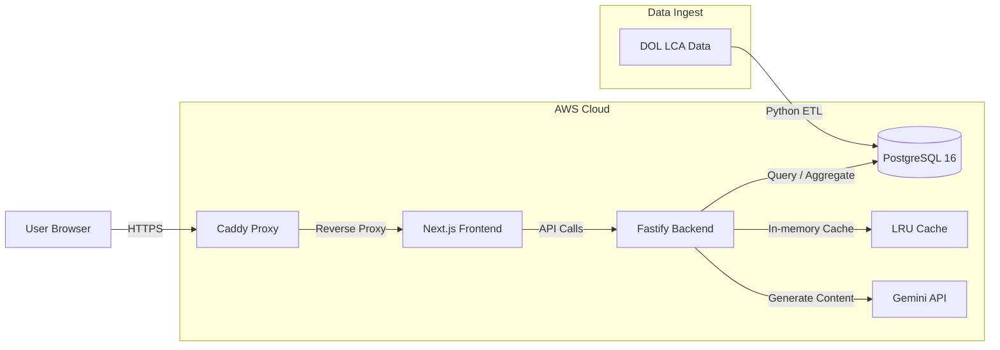

# 🇺🇸 H1B Finder

[](https://opensource.org/licenses/MIT)
[](https://nextjs.org/)
[](https://www.fastify.io/)
[](https://www.postgresql.org/)

**H1B Finder** is a high-performance, open-source platform designed to analyze millions of U.S. Department of Labor (DOL) LCA filings. It provides instant insights into sponsorship trends, salary benchmarks, and employer patterns, optimized to run on resource-constrained infrastructure.

---

## ✨ Key Features

- **Rankings & Trends**: Explore company-wide and job-title-level sponsorship rankings across multiple fiscal years.
- **Sponsor Stability Indicator**: Automatically assesses employer hiring stability (Stable, Moderate, Volatile) based on historical filing volume and consistency.
- **Salaries Benchmarking**: Normalized salary data for thousands of job roles and employers.
- **AI-Powered Insights**: Integrated AI assistant grounded with local H1B data for natural language exploration.
- **Blazing Fast UX**: Sub-second response times for complex aggregations on multi-million record datasets.

---

## 🏗 System Architecture

We employ a modern, containerized stack optimized for high-throughput analytical queries on a modest footprint.



---

## ⚡️ Performance Engineering

Handling **4 million records** on a 2GB RAM / 2 vCPU (`t3.small`) instance required surgical optimization:

### 1. Database: Covering Indexes
Standard indexes were insufficient as disk I/O throttled the server. We implemented specialized **Covering Indexes** using the `INCLUDE` clause, allowing core aggregations to perform **100% in-memory** Index-Only Scans.
- **Result**: Latency reduced from ~75s to **3s**.

### 2. Application: LRU Caching
Concurrent dashboard refreshes are handled via a global **LRU In-Memory Cache** at the Fastify layer.
- **Latency**: **<2ms** (a 4,500x improvement over cold queries).
- **TTL**: 24 hours (syncs with quarterly DOL data update cycle).

---

## 🤖 AI Chat Assistant

The product includes an H1B data assistant grounded with RAG-style context from the local dataset. It is available via:
1.  **Dedicated `/chat` page**: For deep exploration.
2.  **Homepage Modal**: A quick-launch assistant with a blurred backdrop for context-aware questions.

> [!NOTE]
> Chat is disabled unless a `GEMINI_API_KEY` is configured in the environment.

---

## 📂 Project Structure

- **`apps/etl`**: Python-based high-speed ingest pipeline using `Pandas`.
- **`apps/backend`**: Fastify REST API providing normalized H1B analytics.
- **`apps/web`**: Next.js App Router frontend with data visualization.
- **`infra/`**: Terraform configurations for AWS networking and EC2 provisioning.
- **`docker-compose.yml`**: Unified orchestration for PostgreSQL, backend, web, and Caddy.

---

## 🚀 Quick Start

### 1. Prerequisites
- Docker & Docker Compose
- Node.js 20+

### 2. Configure Environment
Create a root `.env` file:
```bash
POSTGRES_PASSWORD=change_me
GEMINI_API_KEY=your_gemini_api_key
GEMINI_MODEL=gemini-2.5-flash
CHAT_RATE_LIMIT_PER_MIN=20
```

### 3. Launch Stack
```bash
git clone https://github.com/ewangchong/h1bfinder.com.git
cd h1bfinder.com
docker compose up -d
```

---

## 👥 Team & Principles

H1B Finder is built by a cross-functional AI-native team with a focus on coordination and execution discipline.

- **Coordination**: Led by a Chief of Staff (COS) as the single coordination entry point.
- **Operating Principle**: Fast iteration without losing accountability or domain judgment.

---

## ⚖️ License

Distributed under the MIT License. See `LICENSE` for more information.

---

_Developed with ❤️ for the H1B community._
